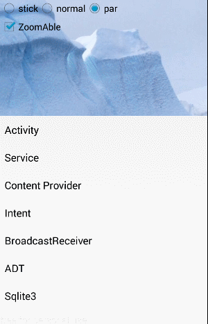

原本打算写系列关于自定义view的文章，包括onTouch涉及到的对应MotionEvent一些介绍，
其中就计划用这个[轮子](https://github.com/matrixxun/PullToZoomInListView)来做案例讲解。
不过原项目代码格式看起来有点不和胃口，顺便做了些调整，使他支持三种不同的滑动模式。
现在先把代码贴在这里，哪天合适再写文章.

- STICK ：头部图片固定不动的样子，下面的各个item上滚
- NORMAL：正常的listView效果
- PARALLAX： 头部图片有些折叠的效果

# 具体效果看下面

1. 这个是stick的效果，可以看到头部图片不动

2. 这个是normal的效果，和正常的效果一样

3. 这个是parallax的效果，可以看到头部和listView有并行折叠效果

